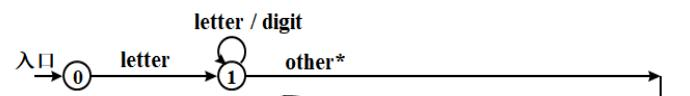
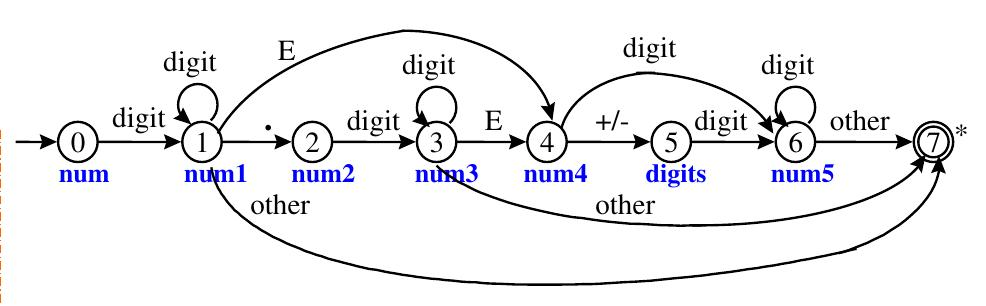
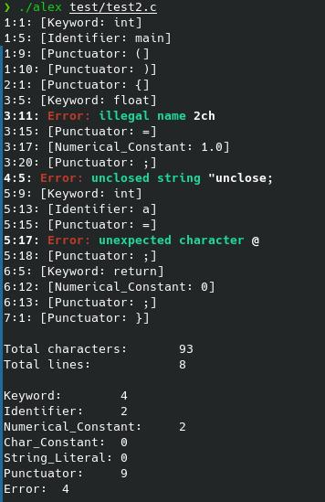
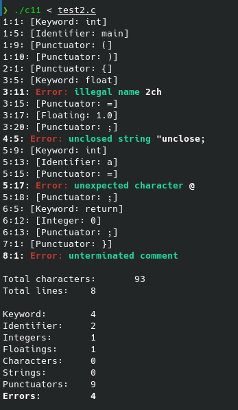

# 1. C语言词法分析程序的设计与实现

- [1. C语言词法分析程序的设计与实现](#1-c语言词法分析程序的设计与实现)
  - [1.1. 实验内容及要求](#11-实验内容及要求)
  - [1.2. 实验环境](#12-实验环境)
  - [1.3. 程序设计说明](#13-程序设计说明)
    - [1.3.1. 目录结构](#131-目录结构)
    - [1.3.2. Token类型及对应的自动机](#132-token类型及对应的自动机)
    - [1.3.3. 程序划分](#133-程序划分)
  - [1.4. 测试结果](#14-测试结果)
    - [1.4.1. 方法1](#141-方法1)
      - [1.4.1.1. 没有词法错误的程序`test/test1.c`](#1411-没有词法错误的程序testtest1c)
      - [1.4.1.2. 有词法错误的程序`test/test2.c`](#1412-有词法错误的程序testtest2c)
    - [1.4.2. 方法2](#142-方法2)
      - [1.4.2.1. 没有词法错误的程序`flex/test1.c`](#1421-没有词法错误的程序flextest1c)
      - [1.4.2.2. 有词法错误的程序`flex/test2.c`](#1422-有词法错误的程序flextest2c)

## 1.1. 实验内容及要求

1. 可以识别出用C语言编写的源程序中的每个单词符号，并以记号的形式输出每个单词符号。
2. 可以识别并跳过源程序中的注释。
3. 可以统计源程序中的语句行数、各类单词的个数、以及字符总数，并输出统计结果。
4. 检查源程序中存在的词法错误，并报告错误所在的位置。
5. 对源程序中出现的错误进行适当的恢复，使词法分析可以继续进行，对源程序进行一次扫描，即可检查并报告源程序中存在的所有词法错误。

## 1.2. 实验环境

x86_64-pc-linux-gnu

## 1.3. 程序设计说明

分别用以下两种方法实现：

1. 采用C/C++作为实现语言，手工编写词法分析程序。（必做）
2. 编写LEX源程序，利用LEX编译程序自动生成词法分析程序。

### 1.3.1. 目录结构

```
.
// 手工编写的词法分析程序部分
├── alex                可执行程序(Linux下)
├── alex.cpp            主程序
├── lexer.cpp           语法分析类实现
├── token.cpp           标记类实现
├── lexer.h             语法分析类声明
├── token.h             标记类声明
├── Makefile            工程文件规则
├── README.md           Markdown文档
├── README.pdf          PDF文档
├── def
│   ├── KEYWORD.def     关键词集合
│   ├── PUNCTUATOR.def  标点符号集合
│   └── TOKEN_TYPE.def  标记类型集合
// LEX编译程序自动生成的词法分析程序
├── flex
│   ├── c11             可执行程序(Linux下)
│   ├── c11.lex         LEX源程序
│   ├── lex.yy.c        flex根据LEX源程序生成的.c源代码
│   ├── Makefile        工程文件规则
│   ├── README.md       Markdown文档
│   ├── test1.c         测试程序1
│   ├── test2.c         测试程序2
│   └── test2.png       测试程序2输出效果
// 测试程序
└── test
    ├── test1.c
    └── test2.c
```

### 1.3.2. Token类型及对应的自动机

* Keyword: 关键词。C中的保留字。
* Identifier: 标识符。变量名或函数名。



* Numerical_Constant: 数值常量。



* Char_Constant: 字符常量。如`'a'`。
* String_Literal: 字符串常量。如`"bupt\n"`。
* Punctuator: 运算符。
* Error: 异常Token。

### 1.3.3. 程序划分

程序定义了`Lexer`类和`Token`类。

* `Lexer`类: 实现词法分析器。
* `Token`类: 产生标识对象。

对应的成员变量和成员函数的功能在`lexer.h`和`token.h`中的注释中有详细的解释。

## 1.4. 测试结果

### 1.4.1. 方法1

#### 1.4.1.1. 没有词法错误的程序`test/test1.c`

```
> ./alex test/test1.c
4:1: [Keyword: int]
4:5: [Identifier: main]
4:9: [Punctuator: (]
4:10: [Punctuator: )]
5:1: [Punctuator: {]
9:5: [Keyword: char]
9:10: [Punctuator: *]
9:11: [Identifier: msg]
9:15: [Punctuator: =]
9:17: [String_Literal: "Hello "]
9:25: [Punctuator: ;]
10:5: [Keyword: float]
10:11: [Identifier: d]
10:13: [Punctuator: =]
10:15: [Numerical_Constant: 0.145e+3]
10:23: [Punctuator: ;]
11:5: [Identifier: printf]
11:11: [Punctuator: (]
11:12: [String_Literal: "%s %f\n"]
11:21: [Punctuator: ,]
11:23: [Identifier: msg]
11:26: [Punctuator: ,]
11:28: [Identifier: d]
11:29: [Punctuator: )]
11:30: [Punctuator: ;]
12:5: [Keyword: return]
12:12: [Numerical_Constant: 0]
12:13: [Punctuator: ;]
13:1: [Punctuator: }]

Total characters:       181
Total lines:            13

Keyword:        4
Identifier:     6
Numerical_Constant:     2
Char_Constant:  0
String_Literal: 2
Punctuator:     15
Error:  0
```

#### 1.4.1.2. 有词法错误的程序`test/test2.c`

源程序

```c
int main()
{
    float 2ch = 1.0;
    "unclose;
        int a = @;
    return 0;
}
/* Comment
```



### 1.4.2. 方法2

#### 1.4.2.1. 没有词法错误的程序`flex/test1.c`

```
> ./c11 < test1.c
4:1: [Keyword: int]
4:5: [Identifier: main]
4:9: [Punctuator: (]
4:10: [Punctuator: )]
5:1: [Punctuator: {]
9:5: [Keyword: char]
9:10: [Punctuator: *]
9:11: [Identifier: msg]
9:15: [Punctuator: =]
9:17: [String: "Hello "]
9:25: [Punctuator: ;]
10:5: [Keyword: float]
10:11: [Identifier: d]
10:13: [Punctuator: =]
10:15: [Floating: .145e+03f]
10:24: [Punctuator: ;]
11:5: [Identifier: printf]
11:11: [Punctuator: (]
11:12: [String: "%s %f\n"]
11:21: [Punctuator: ,]
11:23: [Identifier: msg]
11:26: [Punctuator: ,]
11:28: [Identifier: d]
11:29: [Punctuator: )]
11:30: [Punctuator: ;]
12:5: [Keyword: return]
12:12: [Integer: 0]
12:13: [Punctuator: ;]
13:1: [Punctuator: }]

Total characters:       182
Total lines:    13

Keyword:        4
Identifier:     6
Integers:       1
Floatings:      1
Characters:     0
Strings:        2
Punctuators:    15
Errors:         0
```

#### 1.4.2.2. 有词法错误的程序`flex/test2.c`

源程序

```c
int main()
{
    float 2ch = 1.0;
    "unclose;
        int a = @;
    return 0;
}
/* Comment
```



## 参考资源

* [name1e5s/cLex](https://github.com/name1e5s/cLex)
* [ANSI C grammar, Lex specification](https://www.lysator.liu.se/c/ANSI-C-grammar-l.html)
* [N1570, the final draft of C1X, dated 12 April 2011](http://www.open-std.org/jtc1/sc22/wg14/www/docs/n1570.pdf)
