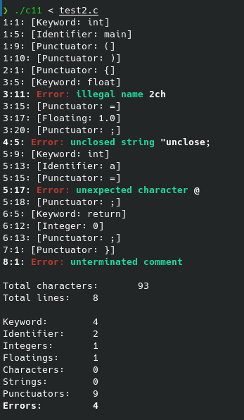

```bash
make c11
./c11 < example.c
```

# `test1.c`

```bash
> ./c11 < test1.c
4:1: [Keyword: int]
4:5: [Identifier: main]
4:9: [Punctuator: (]
4:10: [Punctuator: )]
5:1: [Punctuator: {]
9:5: [Keyword: char]
9:10: [Punctuator: *]
9:11: [Identifier: msg]
9:15: [Punctuator: =]
9:17: [String: "Hello "]
9:25: [Punctuator: ;]
10:5: [Keyword: float]
10:11: [Identifier: d]
10:13: [Punctuator: =]
10:15: [Floating: .145e+03f]
10:24: [Punctuator: ;]
11:5: [Identifier: printf]
11:11: [Punctuator: (]
11:12: [String: "%s %f\n"]
11:21: [Punctuator: ,]
11:23: [Identifier: msg]
11:26: [Punctuator: ,]
11:28: [Identifier: d]
11:29: [Punctuator: )]
11:30: [Punctuator: ;]
12:5: [Keyword: return]
12:12: [Integer: 0]
12:13: [Punctuator: ;]
13:1: [Punctuator: }]

Total characters:       182
Total lines:    13

Keyword:        4
Identifier:     6
Integers:       1
Floatings:      1
Characters:     0
Strings:        2
Punctuators:    15
Errors:         0
```

# `test2.c`

